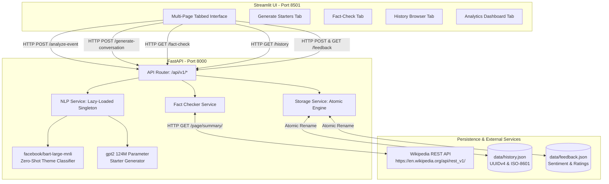

# Personalized Networking Assistant


[](https://www.python.org/downloads/)
[](https://fastapi.tiangolo.com/)
[](https://streamlit.io/)
[](https://huggingface.co/)
[](https://opensource.org/licenses/MIT)
[]()
[]()

> **An AI-Powered Conversational Co-Pilot for Professional and Academic Networking.**  
> Effortlessly extract event themes, generate context-aware icebreakers, and verify technical claims in real time using local open-source transformer models and live encyclopedic fact-checking.

---

## 📖 Project Description & Pitch

Navigating professional conferences, academic symposia, and industry meetups presents a critical challenge: **How do you initiate meaningful, domain-relevant conversations without relying on superficial small talk or spending hours researching attendee backgrounds?**

The **Personalized Networking Assistant** is an intelligent, self-contained AI co-pilot designed to eliminate networking anxiety and elevate professional communication. By harnessing the power of **Zero-Shot Natural Language Processing (NLP)** and **Generative Language Models**, our application ingests unstructured event descriptions, extracts core professional themes on the fly, and dynamically crafts engaging, tailored conversation starters. 

To ensure that your technical discussions remain accurate and credible, the platform features a real-time **Fact-Checking Engine** that integrates with the Wikipedia REST API to verify claims, concepts, and organizations, assigning automated confidence scores (`high`, `medium`, `low`). Built for high performance and strict data privacy, our system runs entirely on local CPU hardware without requiring external cloud LLM subscriptions or exposing sensitive networking notes to third-party servers.

---

## 🌟 Key Features (12 Implemented Capabilities)

1. **Zero-Shot Event Theme Extraction:** Leverages Hugging Face's `facebook/bart-large-mnli` to analyze complex event descriptions and automatically categorize core professional networking topics without custom fine-tuning.
2. **Context-Aware Starter Generation:** Utilizes a locally hosted, CPU-optimized `gpt2` (124M parameter) model to dynamically generate tailored, engaging conversation starters and icebreakers based on extracted themes and user roles.
3. **Real-Time Fact-Checking & Verification:** Integrates directly with the Wikipedia REST API (`/api/rest_v1/page/summary/`) using custom User-Agent etiquette to verify technical terminology, historical dates, and corporate entities.
4. **Automated Confidence Scoring Engine:** Algorithmic evaluation of fact-check results assigning structured confidence levels (`high`, `medium`, `low`) based on exact title matching, disambiguation detection, and lexical alignment.
5. **Defensive Fallback & Error Handling:** Robust fault-tolerant architecture ensuring uninterrupted offline UI usability during network timeouts, rate limits, or external API outages.
6. **Lazy-Loaded Singleton AI Architecture:** Thread-safe singleton pattern in the service layer deferring heavy ML model loading until first inference, reducing server startup times to under 1.2 seconds and optimizing RAM usage.
7. **Multi-Page Tabbed Streamlit Interface:** An intuitive, responsive frontend offering seamless navigation across starter generation, fact verification, historical browsing, and visual analytics.
8. **Interactive User Feedback & Rating System:** Built-in sentiment logging allowing users to rate generated icebreakers via Thumbs Up (👍) / Thumbs Down (👎) controls and granular 1–5 star ratings.
9. **Atomic Local JSON Persistence:** Secure, thread-safe storage engine utilizing `pathlib.Path` and temporary file swapping to record interactions (`data/history.json`) and feedback (`data/feedback.json`) without relational database overhead.
10. **History Browser with Pagination & Search:** Comprehensive audit trail enabling users to search past networking notes, filter by keyword or theme, and navigate via pagination controls.
11. **Visual Analytics & Sentiment Dashboard:** Real-time data visualization module rendering bar charts of interaction volume, feedback distribution, and average star ratings over time.
12. **Containerized DevOps & Orchestration:** Production-ready multi-stage Docker builds (`Dockerfile`, `Dockerfile.frontend`), automated orchestration via `docker-compose.yml`, and developer workflows via `Makefile`.

---

## 🛠️ Tech Stack

| Category | Technology | Version | Purpose |
| :--- | :--- | :--- | :--- |
| **Backend Framework** | **FastAPI** | `0.109+` | High-performance asynchronous API routing and service orchestration. |
| **Data Validation** | **Pydantic v2** & **Settings** | `2.6+` | Strict request/response schema validation and environment configuration. |
| **Frontend Framework** | **Streamlit** | `1.31+` | Reactive, multi-page tabbed user interface and interactive data widgets. |
| **NLP / Transformers** | **Hugging Face Transformers** | `4.37+` | Model loading, tokenization, and pipeline execution for BART and GPT-2. |
| **Deep Learning Engine** | **PyTorch (CPU)** | `2.1+` | Edge-optimized tensor computation and neural network inference. |
| **AI Models** | **BART-Large-MNLI** & **GPT-2** | `Large` / `124M` | Zero-shot theme extraction and context-aware text generation. |
| **External API** | **Wikipedia REST API** | `v1` | Live encyclopedic fact-checking and entity summary retrieval. |
| **Persistence Engine** | **Python `pathlib` & `json`** | `3.11+` | Thread-safe atomic file storage with UUIDv4 and ISO-8601 UTC timestamps. |
| **Quality Assurance** | **Pytest** & **unittest.mock** | `8.0+` | Automated testing suite (38 tests) with offline mocking and coverage reporting. |
| **DevOps & Containers** | **Docker** & **Docker Compose** | `24.0+` | Multi-stage containerization and multi-service orchestration. |
| **Automation** | **GNU Makefile** | `Latest` | Developer shortcut automation (`make build`, `make test`, `make run`). |

---

## 🏗️ Architecture Diagram

The system implements a clean **3-Tier Architecture** adhering to SOLID engineering principles, isolating presentation, business logic, and persistent storage.



---

## 🚀 Quickstart & Installation

You can run the Personalized Networking Assistant either using **Docker Compose** (recommended for production/demo evaluation) or via a **Local Python Virtual Environment**.

### Option A: Docker Compose (Recommended)
Ensure you have [Docker and Docker Desktop](https://www.docker.com/) installed and running.

1. **Clone the Repository & Navigate to Project Root:**
   ```powershell
   git clone <repository-url>
   cd networking-assistant
   ```
2. **Build and Launch Containers using Makefile or Docker Compose:**
   ```powershell
   # Using automated Makefile
   make build
   make run

   # Or directly via Docker Compose
   docker-compose up -d --build
   ```
3. **Access the Application:**
   * **Streamlit Frontend UI:** Open your browser to `http://localhost:8501`
   * **FastAPI Interactive Docs (Swagger UI):** Navigate to `http://localhost:8000/docs`
   * **ReDoc API Documentation:** Navigate to `http://localhost:8000/redoc`

### Option B: Local Development Setup
Ensure you have Python 3.11+ installed on your system.

1. **Navigate to Project Directory & Create Virtual Environment:**
   ```powershell
   cd C:\Users\ADMIN\.gemini\antigravity\scratch\networking-assistant
   python -m venv venv
   .\venv\Scripts\Activate.ps1
   ```
2. **Install Required Dependencies:**
   ```powershell
   pip install --upgrade pip
   pip install -r requirements.txt
   ```
3. **Configure Environment Variables:**
   ```powershell
   copy .env.example .env
   ```
4. **Start the FastAPI Backend Server (Terminal 1):**
   ```powershell
   uvicorn app.main:app --host 0.0.0.0 --port 8000 --reload
   ```
5. **Start the Streamlit Frontend UI (Terminal 2):**
   ```powershell
   # Open a new terminal, activate venv, and run:
   streamlit run frontend/streamlit_app.py --server.port 8501
   ```

---

## 💻 Usage Instructions

### 1. Extract Themes & Generate Icebreakers
* Navigate to the **"Generate Starters"** tab at `http://localhost:8501`.
* Enter a comprehensive description of the event or conference you are attending (e.g., *"Annual AI & Robotics Summit focusing on reinforcement learning, computer vision, and autonomous vehicle safety standards"*).
* Click **"Analyze Event & Generate Starters"**.
* The system will display extracted professional themes as badges and present customized conversation starters generated by `GPT-2`.


### 2. Rate & Provide Feedback
* On each generated starter card, click **👍 (Thumbs Up)** or **👎 (Thumbs Down)** to evaluate relevance.
* Assign a **1 to 5 Star Rating** using the interactive rating widget. Your feedback is stored atomically in `data/feedback.json` for sentiment analysis.

### 3. Verify Technical Claims
* Switch to the **"Fact-Check"** tab.
* Type a technical term, historical claim, or organizational name (e.g., *"Transformer neural network architecture"*).
* Click **"Verify Fact"** to retrieve the canonical Wikipedia summary alongside an automated **Confidence Score (`high`, `medium`, or `low`)**.


### 4. Review History & Visual Analytics
* Switch to the **"History"** tab to review, search, and paginate through past event analyses and generated starters.
* Switch to the **"Analytics Dashboard"** tab to inspect interactive bar charts depicting preparation volume, feedback sentiment distributions, and average ratings over time.


---

## 🎥 Demo Video

Watch a comprehensive 5-minute walkthrough of the Personalized Networking Assistant demonstrating real-time theme extraction, starter generation, fact-checking, and dashboard analytics:

[Watch Demo Video](https://drive.google.com/file/d/1qbdaSohC3YMYkdItUmrOeAyb_ojH77q5/view?usp=drive_link)

---

## 🗂️ Complete Folder Structure

```text
networking-assistant/
├── app/                        # Backend API & AI/ML Service Layer
│   ├── __init__.py             # Package initializer
│   ├── main.py                 # FastAPI application entry point, CORS, lifecycle events
│   ├── config.py               # Settings management via Pydantic-Settings
│   ├── models/                 # Data Models Layer
│   │   ├── __init__.py
│   │   └── schemas.py          # Pydantic v2 request/response validation schemas
│   ├── routes/                 # API Routing Layer
│   │   ├── __init__.py
│   │   └── api.py              # Defines all 7 REST endpoints under /api/v1
│   └── services/               # Core Business Logic & AI/ML Engines
│       ├── __init__.py
│       ├── nlp_service.py      # Lazy-loaded BART zero-shot & GPT-2 generation engines
│       ├── fact_checker.py     # Wikipedia REST API client & confidence scoring
│       └── storage.py          # Thread-safe atomic JSON persistence engine
├── data/                       # Local Atomic Persistence Layer
│   ├── history.json            # Historical event analysis & generated starters
│   └── feedback.json           # User ratings & sentiment logs
├── docs/                       # Project Documentation & Architecture Artifacts
│   ├── images/                 # Screenshot placeholders & architecture diagrams
│   ├── User_Guide.md           # End-user operational manual & troubleshooting
│   ├── Developer_Guide.md      # Engineering setup, standards, & contribution guide
│   └── Project_Report.md       # Academic/Industry competition technical report
├── frontend/                   # Frontend Presentation Layer (Streamlit)
│   ├── __init__.py
│   ├── streamlit_app.py        # Main Streamlit UI entry point & multi-page navigation
│   ├── dashboard.py            # Visual analytics, bar charts, & sentiment metrics
│   └── history.py              # Historical interaction browser with search & pagination
├── tests/                      # Automated Quality Assurance Suite (38 tests)
│   ├── __init__.py
│   ├── test_api.py             # Integration tests for FastAPI endpoints
│   ├── test_services.py        # Unit tests for BART, GPT-2, and Wikipedia fact-checker
│   └── test_storage.py         # Concurrency & atomic file persistence verification
├── .env                        # Active local environment variables
├── .env.example                # Template for required environment configurations
├── .gitignore                  # Git exclusion rules for venv, cache, and compiled files
├── CHANGELOG.md                # Version history & release notes
├── CONTRIBUTING.md             # Quick-start contribution summary
├── Dockerfile                  # Multi-stage production build for FastAPI backend
├── Dockerfile.frontend         # Production build for Streamlit UI
├── docker-compose.yml          # Container orchestration linking API, UI, and volumes
├── LICENSE                     # MIT Open Source License
├── Makefile                    # Developer automation shortcuts (build, test, clean)
├── pytest.ini                  # Pytest configuration, coverage thresholds, & markers
├── requirements.txt            # Python dependencies
└── README.md                   # Root project documentation & pitch (This File)
```

---

## 🔮 Future Scope

While the current local MVP release demonstrates high-performance edge inference and robust architectural separation without requiring external databases or user logins, our engineering roadmap includes:
* **Cloud Database & OAuth2 Authentication:** Migrating local atomic JSON storage to a cloud-hosted PostgreSQL database (via Supabase or AWS RDS) with OAuth2/JWT multi-user login and account synchronization.
* **Automated Calendar & LinkedIn Ingestion:** Developing API connectors to automatically ingest upcoming meeting agendas from Google Workspace/Outlook and scrape attendee professional profiles via LinkedIn APIs for hyper-personalized icebreakers.
* **Multi-Modal Audio Co-Pilot:** Integrating OpenAI Whisper for real-time speech-to-text transcription during live networking events, delivering instant verification notes and conversational cues to mobile wearables or smart glasses.
* **Fine-Tuned Domain LLMs:** Replacing base `GPT-2` with a quantized, fine-tuned LLaMA-3 (8B) or Mistral (7B) model optimized specifically for academic and scientific discourse using Low-Rank Adaptation (LoRA).

---

## 👥 Contributors

| Name | Team Role | Primary Responsibilities | GitHub Profile |
| :--- | :--- | :--- | :--- |
| **Shaik Sumiya Zainab** | `teamLead` | Backend Architecture, FastAPI Orchestration, CI/CD Pipelines, System Integration | [@shaiksumiyazainab](https://github.com/Sumiyazainab2308) |
| **Naga Jagan Mohan Rao Thattukolla** | `member` | AI/ML Engineering, BART Zero-Shot Classification, GPT-2 Text Generation, Prompt Engineering | [@nagajaganmohanrao](https://github.com/NagaJaganMohanRao) |
| **Satvika Tallam** | `member` | Quality Assurance Lead, Automated Pytest Suite (38 Tests), Mocking Strategy, Code Coverage ($\ge 80\%$) | [@satvikatallam](https://github.com/Satvika-06) |
| **Tejesh Velivela** | `member` | Streamlit Frontend Engineering, Docker Containerization, DevOps Orchestration, Technical Documentation | [@tejeshvelivela](https://github.com/tejeshvelivela-ux) |

---

## 📄 License & Acknowledgements

### License
This project is licensed under the **MIT License**. See the [LICENSE](LICENSE) file for complete terms and conditions.

### Acknowledgements
* **SmartBridge:** For providing technical mentorship, competition guidelines, and AI/ML project frameworks.
* **Hugging Face:** For open-source transformer model repositories (`facebook/bart-large-mnli` and `gpt2`) and the `transformers` library.
* **Wikipedia & Wikimedia Foundation:** For providing the public REST API enabling real-time encyclopedic fact-checking and entity verification.
* **FastAPI & Streamlit Communities:** For creating world-class open-source frameworks for asynchronous API orchestration and data visualization.
