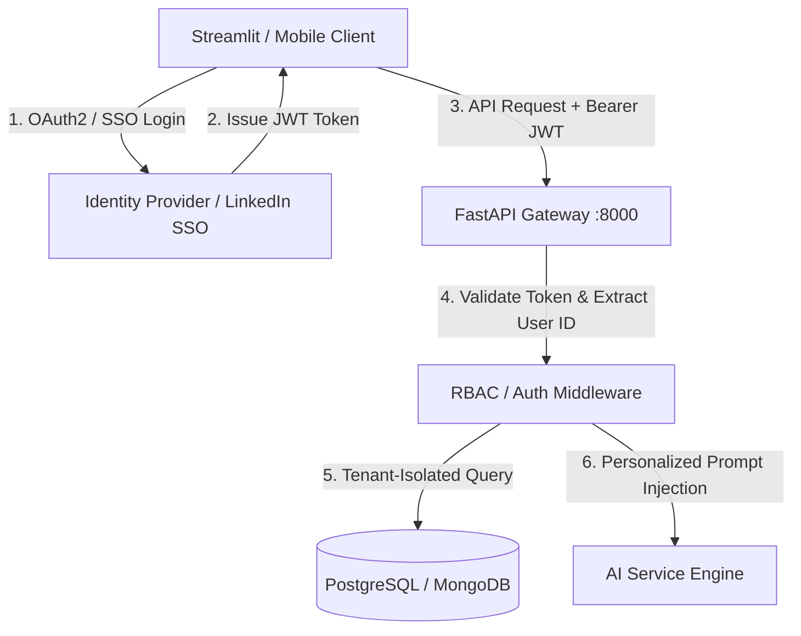
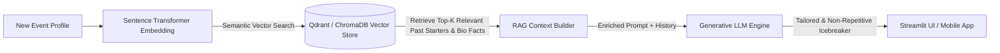
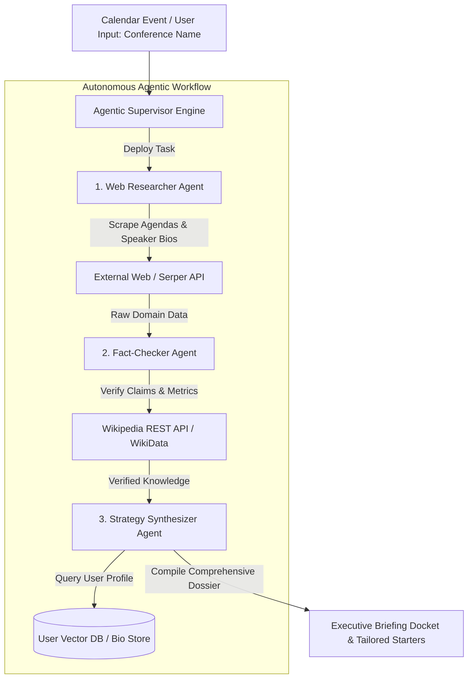

# Future Enhancements and Engineering Roadmap
**Project:** Personalized Networking Assistant  
**Repository:** `networking-assistant`  
**Document Version:** 1.0.0  
**Date:** July 2026  
**Authors:** Shaik Sumiya Zainab, Naga Jagan Mohan Rao Thattukolla, Satvika Tallam, Tejesh Velivela  

---

## 1. Executive Summary

The **Personalized Networking Assistant** in its current Minimum Viable Product (MVP) stage successfully delivers offline, privacy-preserving conversation starter generation, zero-shot theme extraction, and real-time fact-checking using local CPU-bound HuggingFace models (`facebook/bart-large-mnli`, `gpt2` 124M) and atomic JSON persistence. 

To transition this competition-ready prototype into an enterprise-grade AI productivity platform, a robust engineering roadmap has been established. This document outlines ten realistic engineering, AI/ML, DevOps, and product enhancements designed to scale system capabilities, elevate personalization, incorporate multi-user architectures, and introduce autonomous agentic workflows.

---

## 2. Roadmap of Engineering and Product Enhancements

### 2.1 Better AI Personalization & Domain Fine-Tuning
- **Current Limitation:** The system relies on base `gpt2` (124M parameters) with static prompt engineering templates, which can occasionally produce generic conversational phrasing.
- **Proposed Enhancement:** Implement domain-specific fine-tuning and Low-Rank Adaptation (LoRA / PEFT) adapters trained on curated professional networking datasets (e.g., tech conference transcripts, academic symposium Q&As, executive mixer dialogues).
- **Technical Implementation:**
  - Fine-tune open-weights models (e.g., Llama-3-8B-Instruct or Mistral-7B-v0.3) using HuggingFace `PEFT` and `bitsandbytes` for 4-bit quantization (QLoRA).
  - Develop user-specific tone adapters allowing users to toggle conversational styles: *Formal Executive*, *Casual Tech Meetup*, *Academic Research*, or *Recruiter Pitch*.
  - Integrate dynamic prompt enrichment that adapts vocabulary complexity based on the recipient's seniority level.

### 2.2 Multi-Language Support for Global Networking
- **Current Limitation:** Theme extraction and conversation generation operate exclusively in English.
- **Proposed Enhancement:** Expand NLP pipelines to support multilingual networking across major global business languages (Spanish, French, German, Mandarin, Japanese, and Hindi).
- **Technical Implementation:**
  - Replace `facebook/bart-large-mnli` with multilingual zero-shot classifiers such as `facebook/mbart-large-50-many-to-many-mmt` or `xlm-roberta-large-xnli`.
  - Upgrade the generative backbone to multilingual LLMs (e.g., Bloom-560M, Qwen2.5-7B-Instruct, or Aya-23).
  - Implement language detection on the FastAPI backend using `langdetect` or `fasttext`, automatically routing prompts to appropriate language-specific prompt templates and Wikipedia language endpoints (`https://{lang}.wikipedia.org/api/rest_v1/`).

### 2.3 Authentication Improvements & Multi-User Architecture
- **Current Limitation:** To satisfy MVP privacy and zero-cloud footprint constraints, the system currently utilizes single-user local atomic JSON storage (`data/history.json`, `data/feedback.json`) without user authentication or session isolation.
- **Proposed Enhancement:** Implement an enterprise-grade authentication and authorization layer supporting multi-tenant user profiles, Role-Based Access Control (RBAC), and cloud/on-premise database synchronization.
- **Technical Implementation:**
  - Introduce OAuth2 with Single Sign-On (SSO) providers (LinkedIn, Google, GitHub, Microsoft Entra ID) via `Authlib` and FastAPI security utilities.
  - Implement stateless JSON Web Token (JWT) bearer authentication with refresh/access token rotation.
  - Migrate persistence from local atomic JSON files to an asynchronous PostgreSQL or MongoDB database using SQLAlchemy 2.0 / Motor ODM, enforcing strict tenant-ID data isolation across all historical sessions and feedback logs.

### 2.4 Resume & Professional Profile Parsing Enhancements
- **Current Limitation:** Users manually input their role and industry domain into the Streamlit UI for each event.
- **Proposed Enhancement:** Build an automated document ingestion engine capable of parsing uploaded PDF, DOCX, and TXT resumes or executive biographies to automatically extract rich professional context.
- **Technical Implementation:**
  - Integrate document parsing libraries (`pdfplumber`, `PyPDF2`, or `unstructured`) into a new FastAPI endpoint (`POST /api/v1/profile/upload`).
  - Apply Named Entity Recognition (NER) via spaCy (`en_core_web_trf`) or a lightweight LLM extraction prompt to identify core competencies, past project domains, academic degrees, and career achievements.
  - Construct a persistent user profile schema that automatically injects relevant background achievements into conversation starter prompts, generating hyper-personalized talking points (e.g., *"I noticed you're also working on distributed systems; in my recent work with Kubernetes..."*).

### 2.5 Calendar Integration & Automated Event Detection
- **Current Limitation:** Networking preparation is reactive; users must manually initiate sessions prior to attending events.
- **Proposed Enhancement:** Transform the assistant into a proactive networking scheduler by synchronizing with user digital calendars.
- **Technical Implementation:**
  - Integrate Microsoft Graph API (Outlook Calendar) and Google Calendar API via OAuth2 scopes (`calendar.readonly`).
  - Implement an automated background scheduler (using `Celery` or `APScheduler` within FastAPI) that scans upcoming calendar appointments for networking signals (e.g., keywords like *Conference*, *Meetup*, *Summit*, *Symposium*, *Mixer*).
  - Automatically extract event metadata, organizer notes, location, and attendee lists, generating a preparatory "Networking Dossier" and delivering email/UI notifications 24 hours prior to the event.

### 2.6 Email & LinkedIn Automation
- **Current Limitation:** Generated conversation starters and historical notes remain confined within the Streamlit UI.
- **Proposed Enhancement:** Enable seamless post-event follow-up workflows by connecting directly to communication platforms and professional networks.
- **Technical Implementation:**
  - Integrate LinkedIn Official API and Gmail/Outlook APIs for automated message drafting.
  - Create a "One-Click Follow-Up" feature in the History tab: users select a past conversation starter, input the new contact's name, and the system generates a tailored follow-up message (e.g., *"It was great discussing [BART-extracted Theme] at [Event Name] yesterday..."*).
  - Allow direct exporting of follow-up drafts to email drafts folders or copying formatted text formatted specifically for LinkedIn connection request limits (300 characters).

### 2.7 Advanced Analytics Dashboard
- **Current Limitation:** The MVP dashboard provides basic bar charts tracking theme distributions, average star ratings, and positive/negative feedback counts.
- **Proposed Enhancement:** Upgrade the analytics suite to provide deep conversational intelligence and longitudinal networking progress tracking.
- **Technical Implementation:**
  - Replace standard Streamlit charts with interactive Plotly and Altair data visualizations supporting drill-down filtering, zooming, and time-series forecasting.
  - Implement advanced NLP topic modeling (BERTopic or Latent Dirichlet Allocation - LDA) over historical conversation logs to identify emerging industry trends and shifts in networking interests over time.
  - Track "Networking Conversion Metrics" where users log post-event outcomes (e.g., *LinkedIn Connection Made*, *Follow-Up Meeting Scheduled*, *Job Referral Secured*), correlating prompt styles and AI themes with real-world professional success rates.

### 2.8 Mobile Application Wrapper (React Native / Flutter)
- **Current Limitation:** The UI is accessible primarily as a desktop/browser web application running via Streamlit on port 8501.
- **Proposed Enhancement:** Develop a native mobile application to serve as an on-the-go conference companion during live networking events.
- **Technical Implementation:**
  - Build a cross-platform mobile frontend using React Native or Flutter, communicating directly with the FastAPI backend via RESTful APIs and WebSockets.
  - Implement offline-first local caching using SQLite/Realm on the mobile device, allowing users to access previously generated conversation starters and fact-check summaries even in conference venues with poor Wi-Fi connectivity.
  - Introduce voice-to-text transcription (via OpenAI Whisper small/tiny running locally or mobile native speech APIs) allowing users to record quick post-conversation voice memos that are automatically summarized and linked to the event history.

### 2.9 Vector Database Integration for RAG
- **Current Limitation:** Historical search is currently performed via linear text matching over local JSON files (`data/history.json`). As historical records grow, linear search lacks semantic understanding and cannot cross-reference concepts.
- **Proposed Enhancement:** Integrate a vector database to enable Retrieval-Augmented Generation (RAG) over past conversations, user notes, and ingested industry whitepapers.
- **Technical Implementation:**
  - Embed historical conversation logs, user profile achievements, and fact-checked Wikipedia summaries into high-dimensional vector representations using local embedding models (`sentence-transformers/all-MiniLM-L6-v2` or `bge-small-en-v1.5`).
  - Store and index embeddings within a lightweight vector database such as Qdrant (running via Docker container), ChromaDB (embedded local persistence), or pgvector.
  - When generating new starters, execute a semantic similarity vector search against past successful interactions, retrieving relevant historical context to ensure continuity and avoid repeating previously used icebreakers with same organizations or contacts.

### 2.10 Agentic AI Workflows (Autonomous Event Researcher)
- **Current Limitation:** The assistant relies entirely on user-provided inputs and reactive Wikipedia fact-checking during the conversation generation process.
- **Proposed Enhancement:** Evolve the system from a reactive prompt generator into an autonomous **Agentic AI Event Researcher** capable of proactive multi-step reasoning and web investigation.
- **Technical Implementation:**
  - Implement an agentic orchestration framework using LangChain, LlamaIndex, or native FastAPI background task workers with tool-calling capabilities.
  - Given an upcoming conference name or attendee list, deploy autonomous web scraper tools (using Playwright/BeautifulSoup or Serper/Tavily search APIs) to investigate event agendas, keynote speaker biographies, recent company press releases, and published academic papers.
  - Design a multi-agent workflow:
    1. **Researcher Agent:** Scrapes and summarizes external conference documents and speaker backgrounds.
    2. **Fact-Checker Agent:** Cross-references technical claims and company metrics against Wikipedia and authoritative databases.
    3. **Strategist Agent:** Synthesizes findings with the user's parsed resume to generate a strategic "Executive Briefing Docket" containing highly tailored conversation starters, potential common ground, and insightful questions for specific keynote speakers.

---

## 3. Summary Roadmap & Prioritization Matrix

To ensure systematic engineering execution, the ten future enhancements are categorized by technical complexity, architectural impact, and implementation timeline across three deployment horizons:

| Enhancement Initiative | Target Horizon | Architectural Impact | Technical Complexity | Primary Value Proposition |
| :--- | :--- | :--- | :--- | :--- |
| **Resume & Profile Parsing** | **Horizon 1 (Near-Term, Q3 2026)** | Medium (New API endpoint + document parser) | Medium | Eliminates manual data entry; immediately boosts prompt personalization. |
| **Email & LinkedIn Automation** | **Horizon 1 (Near-Term, Q3 2026)** | Medium (OAuth integrations + UI export tools) | Medium | Bridges event preparation with post-event relationship conversion. |
| **Advanced Analytics Dashboard** | **Horizon 1 (Near-Term, Q3 2026)** | Low (Frontend UI upgrade + Plotly integration) | Low–Medium | Provides deeper visibility into networking habits and prompt efficacy. |
| **Authentication & Multi-User RBAC**| **Horizon 2 (Mid-Term, Q4 2026)** | High (Database migration from JSON to PostgreSQL/MongoDB) | High | Essential for enterprise scaling, SaaS deployment, and multi-tenant security. |
| **Vector Database & RAG Integration**| **Horizon 2 (Mid-Term, Q4 2026)** | High (Embedding pipeline + Qdrant/ChromaDB container) | High | Enables long-term conversational memory and semantic cross-referencing. |
| **Calendar Integration** | **Horizon 2 (Mid-Term, Q4 2026)** | Medium (OAuth scopes + background scheduler) | Medium | Transforms system from reactive tool to proactive networking assistant. |
| **Better AI Personalization (LoRA)** | **Horizon 3 (Long-Term, Q1 2027)** | High (Model training pipeline + PEFT adapter loading) | High | Delivers state-of-the-art domain accuracy and custom tone matching. |
| **Multi-Language Support** | **Horizon 3 (Long-Term, Q1 2027)** | High (Multilingual LLM/BART integration + language routing) | High | Expands product market fit to global international conferences. |
| **Mobile Application Wrapper** | **Horizon 3 (Long-Term, Q1 2027)** | High (New cross-platform client + offline SQLite sync) | High | Provides essential on-the-go utility during live networking events. |
| **Agentic AI Researcher Workflows** | **Horizon 3 (Long-Term, Q2 2027)** | Very High (Multi-agent orchestration + autonomous web tools) | Very High | Represents the ultimate evolution into an autonomous cognitive networking companion. |
